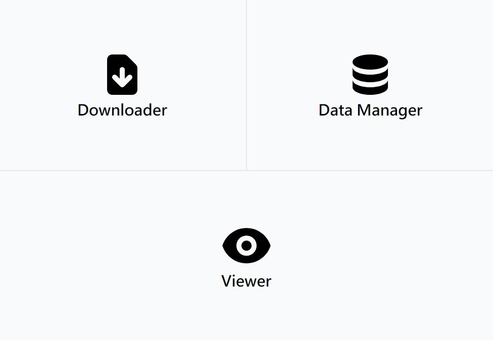
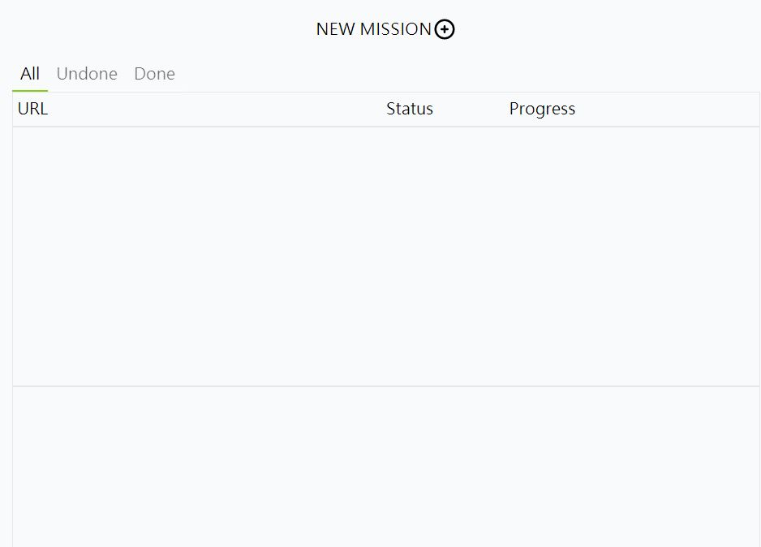

# Electron 漫畫下載兼閱讀器(已棄坑)

## 基於
- [Vue CLI Plugin Electron Builder](https://nklayman.github.io/vue-cli-plugin-electron-builder/guide/#installation)

## 指令
- npm run electron:serve 啟動開發伺服器
- npm run electron:build 打包構建應用 

## demo

## 已棄坑
目前下載器功能是可以正常運作，但檢視與管理只做到一半。

棄坑原因主要是餅畫太大，這工具我是想要做三大功能：下載、檢視、管理，但功能太多加上我對 electron 的不熟悉(第一次使用)變得很難開發，也許下次改用 TypeScript 來協助，。

資料我是使用瀏覽器內建的 IndexDB 儲存，但我覺得在搜尋方面不是很好用，或許下次試試看 MongoDB 或 SQLite。

介面也是一個問題，因為我雖然有簡單規劃過功能，但前端介面完全是想到什麼寫什麼，所以介面變得很……

不過開這專案的初衷是想試試看 Electron ，所以在這次的開發中我是有達到目的與一些收穫，主要是學習到了 Electron 的使用以及增加對本機應用程式的理解： 

mainprocess 與 renderprocess 概念，切割權限提高安全性；

使用 ipc 通訊、background.js、preload.js 功能劃分等等；